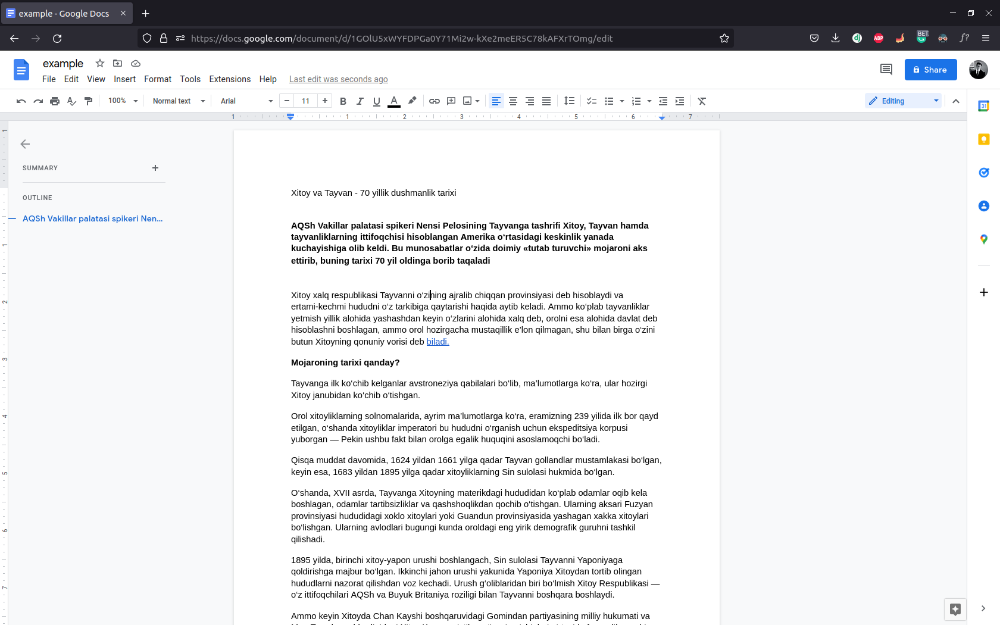
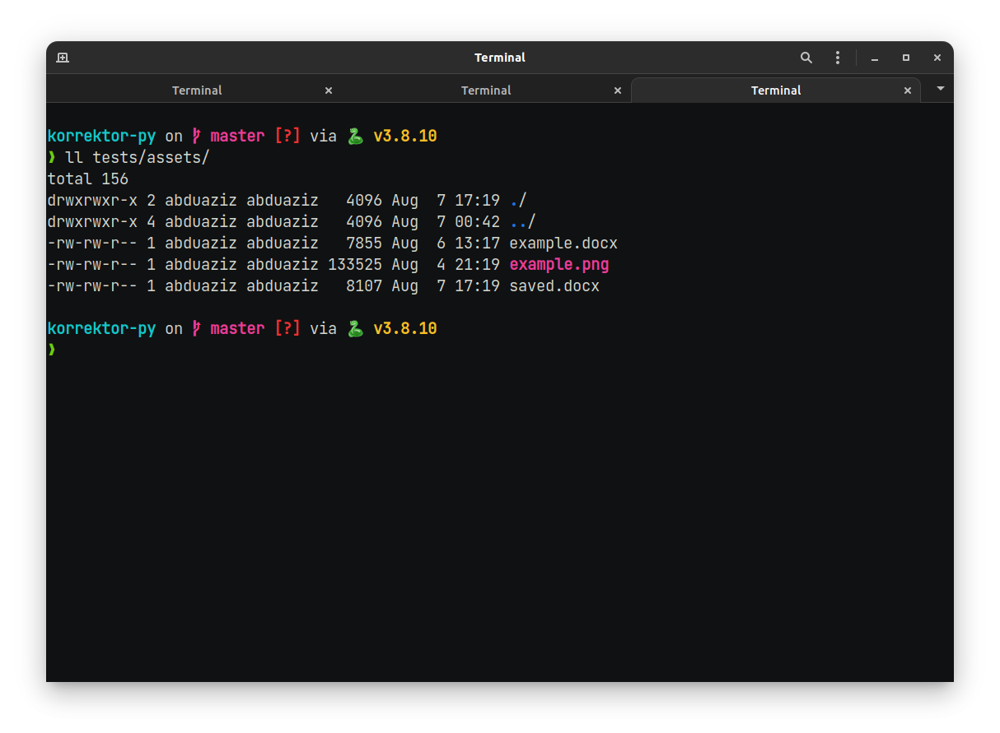
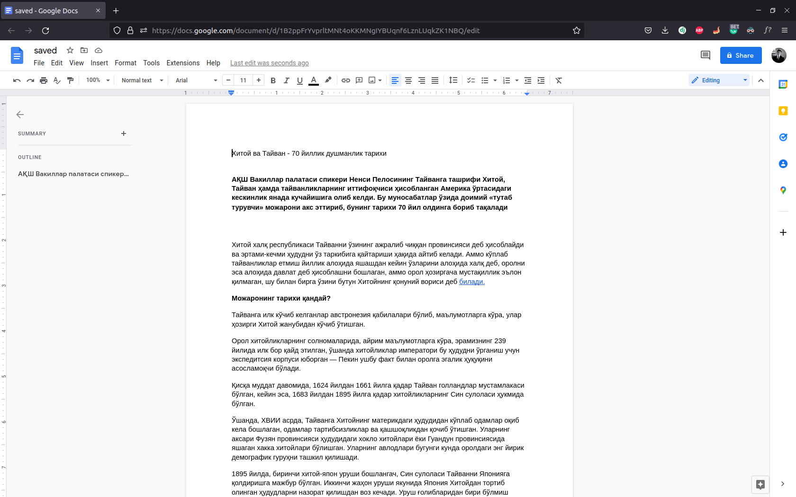

# Metod: `doc`

## **`korrektor_py.core.Korrektor.doc`**

!!! tip "Metod haqida"

    `Docx`, `xlsx`, `pptx`, `epub` va `html` hujjarlarini transliteratsiya qilish uchun

Argumentlari va ularning "tip"lari.

> - `document_path: str` - Transliteratsiya qilinadigan faylga bo'lgan yo'l.
> - `alphabet: str` - Hujjatni qaysi alifboga o’girish. `cyrillic` yoki `latin`
> - `save_path: t.Optional[str]` - O'giriligan hujjat saqlanishi kerak bo'lgan joy.

!!! success "save_path"

    Agar yuqorida majburiy bo'lmagan `save_path`ga hech qanday argument berilmasa, u yuklab olingan faylni skript ishga tushgan joyda saqlaydi.

<hr>

> [FileResponse](/korrektor-py/objects/#korrektor_pymodelsfileresponse) - obyektini qaytaradi

Qo'llanishi:

!!! note ""

    Hujjat va skript bir joyda turgan bo'lsa shunchaki hujjat faylini nomini kiritishingiz mumkin. Quyidagi misolda esa hujjat, python skript turgan joydagi `test/` direktoriyasi ichida joylashgan. Faylga bo'lgan to'liq yo'lni ko'rsatsangiz yanada yaxshi (xuddi `/home/abduaziz/...` kabi).

!!! warning "Ma'lumotlar"

    Hech qaysi bir foydalanuvchining ma'lumotlari serverda saqlanmaydi!

- Hujjat (lotin):
  

Uni kirilga transliteratsiya qilish lozim. Quyidagi kod orqali buni amalga oshirish mumkin:

```python
from korrektor_py import Korrektor

TOKEN =  ...
korrektor = Korrektor(TOKEN)

document_path = "tests/assets/example.docx"
alphabet = "cyrillic"
save_path = "tests/assets/saved.docx"

result = korrektor.doc(document_path, alphabet, save_path)

print(result.dict())
print(result.file_name)
```

**Natija**:

```json
{
  "file_name": "tests/assets/saved.docx",
  "status": "File saved"
}

tests/assets/saved.docx
```

- Faylning borligini tekshirib ko'ramiz:

  

- Natijani tekshirish uchun `Google Docs` orqali saqlangan faylni ochib ko'ramiz:

  

> It works, why ?!
