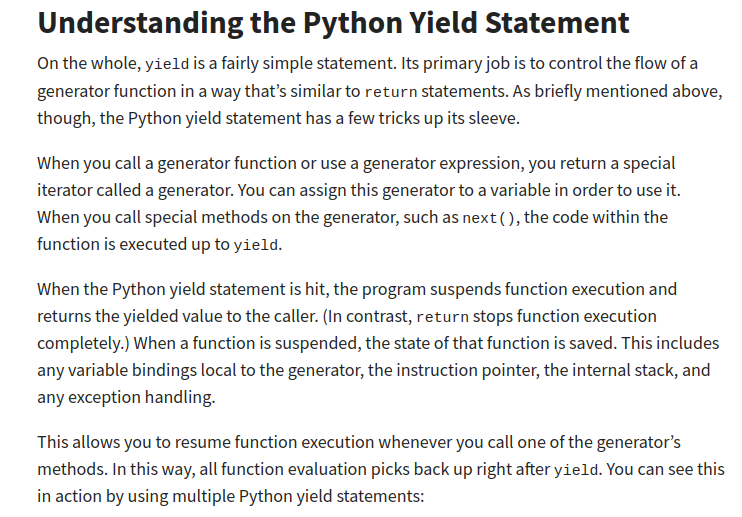
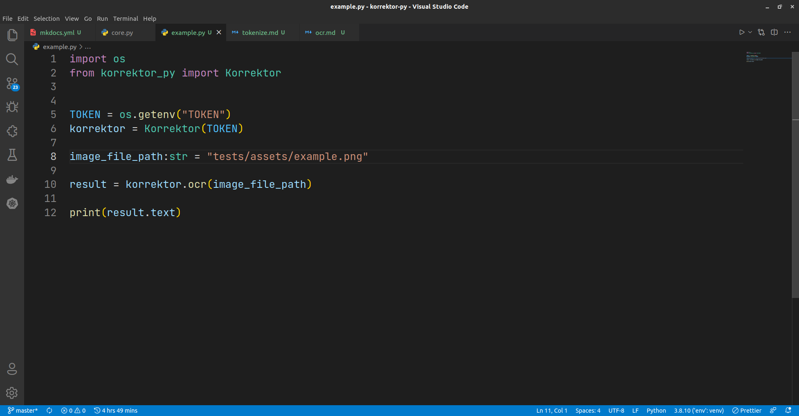
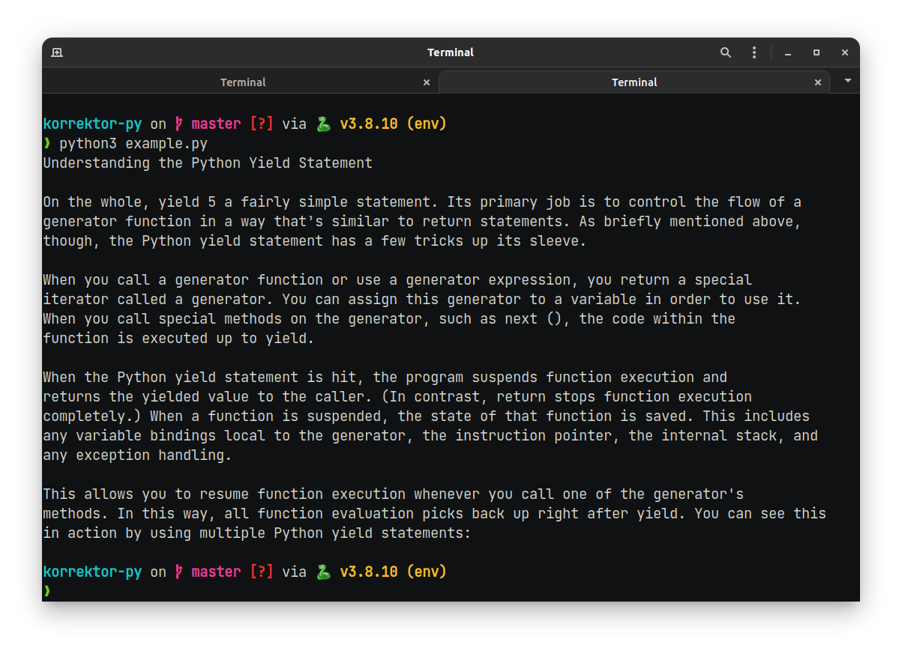

# Metod: `ocr`

## **`korrektor_py.core.Korrektor.ocr`**

!!! tip "Metod haqida"

    Rasmdan matnni ajratib olish uchun

Argumentlari va ularning "tip"lari.

- `image_file_path:str` - Matnni ajratib olinishi kerak bo'lgan rasmli faylga bo'lgan yo'l.

> [ResponseText](/korrektor-py/objects/#korrektor_pymodelsresponsetext) - obyektini qaytaradi

Qo'llanishi:

!!! note ""

    Rasm va skript bir joyda turgan bo'lsa shunchaki rasm faylini nomini kiritishingiz mumkin. Quyidagi misolda esa rasm, python skript turgan joydagi `test/` direktoriyasi ichida joylashgan. Faylga bo'lgan to'liq yo'lni ko'rsatsangiz yanada yaxshi.

!!! warning "Ma'lumotlar"

    Hech qaysi bir foydalanuvchining ma'lumotlari serverda saqlanmaydi!

- Rasm fayli (realpython sahifasidan olindi)
  

- Python kod
  

**Natija**:

!!! example "Faylni tekshirish"

    Pythonning `os` moduli orqali buni amalga oshirishingiz mumkin.

    `os.listdir()` orqali skript ishga tushgan joydagi barcha fayllar va direktoriyalar ro'yxatini olasiz.

    `os.path.isfile` va `os.path.isdir` orqali esa obyektning fayl yoki "papka" ekanligini aniqlashingiz mumkin.
