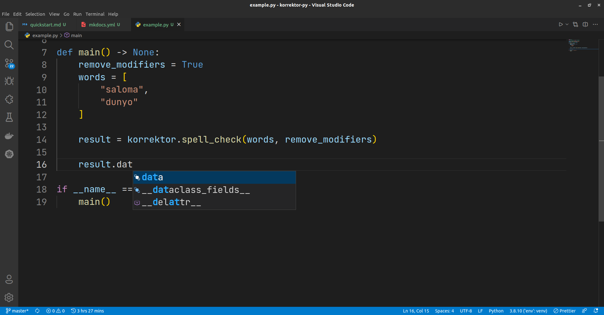

# **Asosiy obyektlar haqida**

## **`korrektor_py.core.Korrektor`**

> `Korrektor` obyekti o'zida `API`ning barcha metodlarini jamlagan

Argumentlar:

- `token:str` - tizim tomonidan berilgan token
- `base_api_url:Optional[str]` - Asosiy API manzili, kutubxona tomonidan `default` qiymat belgilangan.

## **`korrektor_py.api.Client`**

> `Client` obyekti `API` bilan muloqot qilish vazifasida keladi.

Argumentlar:

- `token:str` - tizim tomonidan berilgan token
- `base_api_url:Optional[str]` - Asosiy API manzili, kutubxona tomonidan `default` qiymat belgilangan.

!!! abstract "Annotatsiyalar"

    Dasturchilarga qulaylik yaratish uchun `type-hinting` masalasiga alohida urg'u berilgan. Har bir method muvaffaqiyatli bajarilganida `dict` emas maxsus python obyektini qaytaradi va har bir kiritilgan & chiqarilgan qiymatlar maydonlari bo'yicha tekshiruvdan o'tadi (validation).

    ```python
    # dict bo'lsa
    result["data"]

    # obyekt bo'lsa
    result.data # izi
    ```

    Ushbu "type-hint"lar deyarli barcha zamonaviy kod muharrirlari tomonidan qo'llab quvvatlanadi:

    

Metodlar tomonidan qaytarilgan **barcha** natijalar maxsus obyekt ko'rinishida bo'ladi (`dict` emas). Muvvaqiyatsiz natijalar uchun yagona obyekt (`ResponseError`) qaytariladi.

> ## **`korrektor_py.models.ResponseText`**
>
> - `status:str` - server tomonidan yuborilgan holat haqidagi maxsus so'z. Muvaffaqiyatli javoblar uchun `ok` qaytariladi.
> - `code:str` - yuqoridagi statusga biriktirilgan maxsus kod. Muvaffaqiyatli javoblar uchun `200` qaytariladi.
> - `text:str` - API tomonidan ishlov berilgan so'z yoki gap.

<hr>

> ## **`korrektor_py.models.ResponseData`**
>
> - `status:str` - server tomonidan yuborilgan holat haqidagi maxsus so'z. Muvaffaqiyatli javoblar uchun `ok` qaytariladi.
> - `code:str` - yuqoridagi statusga biriktirilgan maxsus kod. Muvaffaqiyatli javoblar uchun `200` qaytariladi.
> - `data:Iterable` - API tomonidan ishlov berilgan so'z yoki gaplardan iborat massiv.

<hr>

> ## **`korrektor_py.models.FileResponse`**
>
> - `status:str` - holat haqidagi maxsus so'z. Fayl saqlangan bo'lsa `File saved` belgilangan turadi.
> - `file_name:str` - saqlangan fayl nomi yoki joyi.

<hr>

Xatoliklar uchun:

> ## **`korrektor_py.models.ResponseError`**
>
> - `status:str` - server tomonidan yuborilgan holat haqidagi maxsus so'z. Muvaffaqiyatsiz javoblar uchun odatda `error` qaytariladi.
> - `code:str` - yuqoridagi statusga biriktirilgan maxsus kod (`200`dan farqli).
> - `description:str` - API tomonidan qaytarilgan xatolik haqidagi xabar.

!!! note info "Attributlar"

    Yuqoridagilardan qanday foydalanishni bilmayotganlar uchun:
    Misol uchun siz natijani olib terminalga `print` qilib ko'rdingiz va u `ResponseError` obyekti ekan. Tepada ko'rsatilganidek u `status`, `code` va `description` kabi atributlarga ega.

    ```python
    result = korrektor.spell_check(...)

    # xatolik xabarini olish uchun
    description = result.description

    # xatolik statusi
    description = result.status
    # va hokazo
    ```

## **Ba'zi metodlar**

Yuqoridagi obyektlar ba'zi metodlarga ega (ko'p foydalananilgan):

> - `json()` - natijani JSON ko'rinishidagi python'dagi **satr**ga o'tkazadi.
> - `dict()` - obyektni python'dagi `dict` ko'rinishiga o'tkazadi (`dict` != `json str`).

!!! success ""

    Keyingi sahifalarda esa kutubxonada mavjud bo'lgan barcha metodlar va ularni qanday ishlatish haqida birma-bir to'liq ma'lumotlar keltirilgan.
