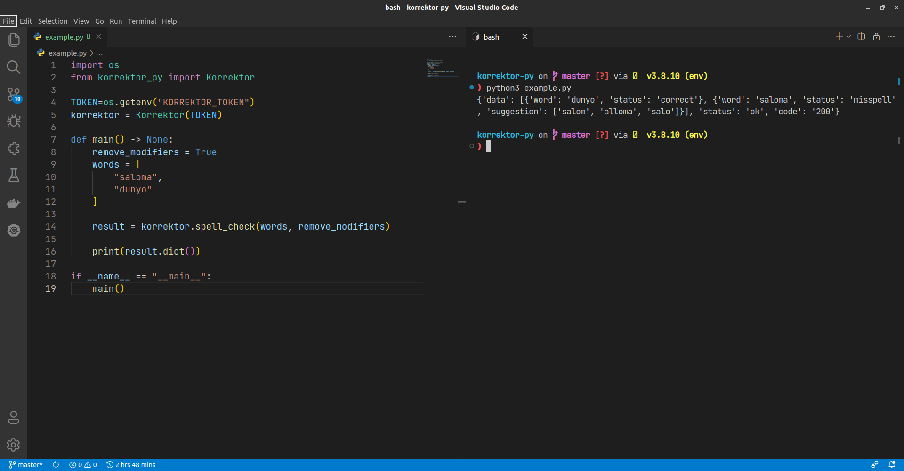

!!! note "Havolalar"

    Loyihaning asosiy [sahifasi](https://korrektor.uz), uning [API'si](https://korrektor.uz/api) va API [yo'riqnomasi](https://korrektor.uz/uploads/Korrektor_api.pdf)

## **Ishni Boshlash**

Kutubxonani o'rnatganingizdan so'ng, undagi API'ning barcha metodlari jamlangan `Korrektor` obyektini loyihaga import qiling. So'ng, ushbu asosiy obyektga sizga tizim tomonidan berilgan token'ni argument sifatida berib, ishga tushuring (initialization).

```python
from korrektor_py import Korrektor

korrektor = Korrektor("SENING_TOKENING")
```

!!! danger "Tokenlar"

    Tokenlar va shunga o'xshash "sirli" ma'lumotlarni kodda saqlash umuman tavsiya etilmaydi. Shuning uchun ularni `.env` ko'rinishidagi fayllar yoki tizimning muhitida (e.g. env variables) saqlang.

    * Terminalda:

        ```bash
        export KORREKTOR_TOKEN=TIZIM_TOMONIDAN_BERILGAN_TOKEN
        ```

    * `code.py` ya'ni kodingizda

        ```python
        import os
        TOKEN = os.getenv("KORREKTOR_TOKEN")
        ```

    > [Qo'shimcha resurs](https://www.twilio.com/blog/environment-variables-python)

## **Metodlardan foydalanish**

Sinov maqsadida imloviy xatolarni tekshirish metodini ishlatib ko'ramiz.

```python
import os
from korrektor_py import Korrektor

TOKEN=os.getenv("KORREKTOR_TOKEN")
korrektor = Korrektor(TOKEN)

def main() -> None:
    remove_modifiers = True
    words = [
        "saloma",
        "dunyo"
    ]

    result = korrektor.spell_check(words, remove_modifiers)

    print(result.dict())

if __name__ == "__main__":
    main()
```



> O'ng tomonda esa `dict`ga o'girilgan API orqali qayta ishlangan ma'lumot. Xullas ishladi ;)
