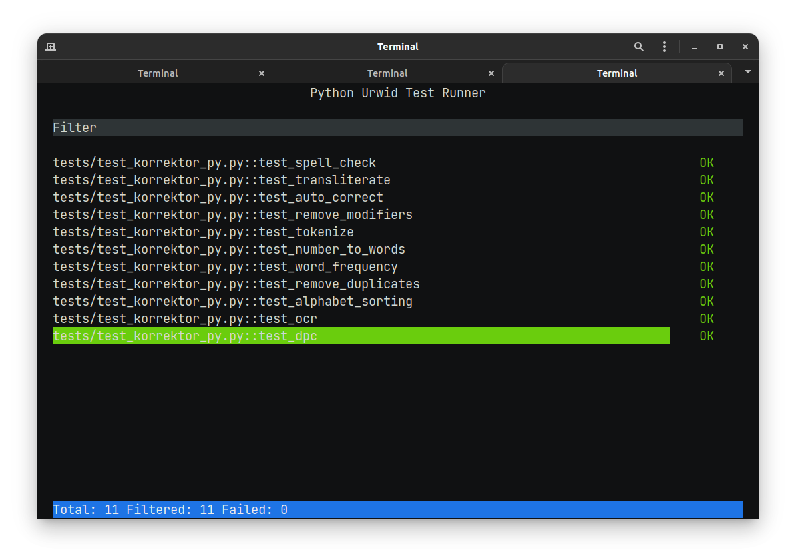

## **Testing**

Loyihani sinovdan o'tkazishda `pytest`dan foydalanildi. Barcha testlar esa `tests/` direktoriyasida va asosiy fayl `test_korrektor_py.py` hisoblanadi.

!!! note "Pytest"

    Agar sizda pytest o'rnatilmagan bo'lsa quyidagi buyruq orqali o'rnatib oling:

    ```bash
    pip install pytest
    ```

Testlarni ishga tushurishdan avval va umuman olganda loyihadan foydalanish uchun sizga tizim tomonidan berilgan maxsus **token** zarur bo'ladi. Sinovdan o'tkazish jarayoni uchun esa "muhit o'zgaruvchilari"(env variables) sifatida e'lon qilgan bo'lishingiz shart.

!!! info "Environment Variables"

    === "Windows"

        ```cmd
        set KALIT=QIYMAT
        ```

    === "Linux va MacOS"

        ```bash
        export KALIT=QIYMAT
        ```

Testlarni ishga tushurish uchun quyidagi buyruqning o'zi yetarli va bunda `pytest`ning o'zi test fayllarini topib oladi:

```bash
pytest tests/
```


